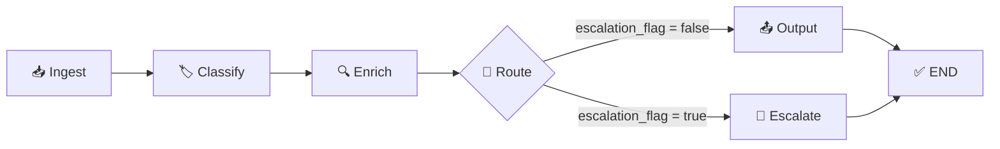
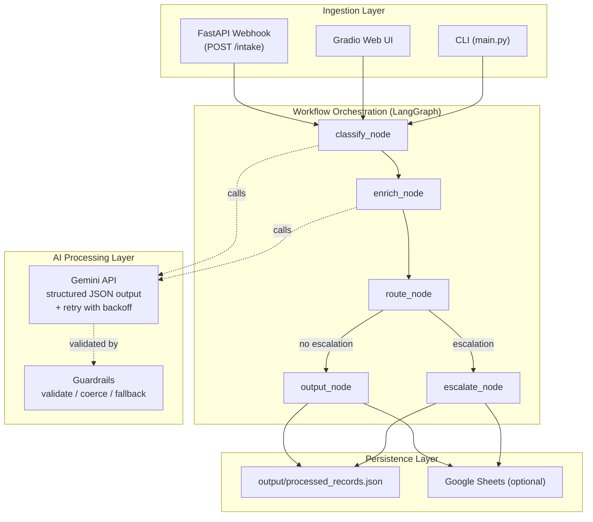

# ArcVault Support Triage System - Architecture Write-Up

## 1. System Design

### Goal

Automate intake, classification, enrichment, routing, and escalation for unstructured ArcVault support requests while producing structured records that downstream teams can act on immediately.

### Pipeline Flow

### Component Architecture

### Components

1. Ingestion Layer
- `ingestion/webhook_api.py` exposes `POST /intake` and `GET /health` with rate limiting.
- `app.py` (Gradio) and `main.py` (CLI) are additional demo/operator interfaces.

2. Workflow Orchestration Layer
- `workflow/graph.py` defines a LangGraph pipeline:
  - `classify_node`
  - `enrich_node`
  - `route_node`
  - conditional branch to `output_node` or `escalate_node`

3. AI Processing Layer
- `integrations/gemini_client.py` calls Gemini with structured JSON output mode (`response_mime_type="application/json"`) and retry with exponential backoff.
- Guardrails in `workflow/nodes.py` sanitize model outputs and prevent malformed responses from breaking the pipeline.

4. Persistence Layer
- Runtime append log: `output/processed_records.json` (with deduplication)
- Deterministic deliverable artifact: `output/submission_records.json`
- Optional Google Sheets sink: `integrations/sheets_client.py`

### State and Data Contract

`TriageState` tracks input, model outputs, routing, escalation metadata, and persistence timestamp.
Key routing fields:

- `record_id`: deterministic SHA-256 hash of source + message for deduplication
- `proposed_queue`: queue implied by category mapping
- `destination_queue`: final dispatch queue (overridden to `Human Review` when escalated)
- `escalation_rules_triggered`: machine-readable reasons
- `escalation_reason`: human-readable explanation

## 2. Routing Logic

### Category-to-Queue Mapping

- `Bug Report -> Engineering`
- `Feature Request -> Product`
- `Billing Issue -> Billing`
- `Technical Question -> IT/Security`
- `Incident/Outage -> Engineering`

### Decision Model

1. Compute `proposed_queue` from category map.
2. Evaluate escalation rules.
3. If escalated, set `destination_queue = Human Review`.
4. If not escalated, set `destination_queue = proposed_queue`.

This design preserves ownership intent (`proposed_queue`) while enforcing safe final routing (`destination_queue`).

## 3. Escalation Logic

A message is escalated when any rule is true:

1. `confidence < 0.70`
2. message contains configured escalation keywords (word-boundary matched to avoid false positives)
3. category is `Billing Issue` and extracted dollar amount delta is `> $500`

Outputs include both machine-readable and human-readable reasons. Example machine rules:

- `low_confidence`
- `keyword:multiple users affected`
- `billing_delta_exceeds_threshold:620.00`

## 4. Reliability and Failure Handling

### LLM Robustness

- **Structured output mode**: `response_mime_type="application/json"` eliminates most JSON parsing issues at the API level.
- **Retry with backoff**: Transient API failures are retried 3 times with exponential backoff and jitter.
- Invalid category/priority values are coerced to safe defaults.
- Confidence is normalized to `[0.0, 1.0]`.
- Classification failures force confidence to `0.0` to trigger safe escalation behavior.
- Enrichment failures return safe fallback fields instead of throwing exceptions.

### Storage Robustness

- Local output directory auto-created if missing.
- JSON append log handles corrupt/empty files by recovering with a fresh list.
- Google Sheets writes are best-effort; failures do not block the core workflow.
- Deduplication prevents duplicate records from repeated processing.

### API Robustness

- In-memory rate limiting (60 requests/minute) on the webhook endpoint.
- Thread-safe workflow singleton via double-checked locking.

### Verification

Deterministic tests cover:

- low-confidence escalation
- keyword escalation (including word-boundary false positive prevention)
- billing-delta escalation
- output schema presence and record ID generation
- webhook API contract validation
- model output guardrails and retry behavior
- deduplication behavior

## 5. Production Scale Considerations

If this moved from assessment to production:

1. Reliability
- Add dead-letter queue for failed records.
- Add structured logging and metrics (error rate, latency, escalation ratio).
- Move deduplication from in-memory to persistent store (Redis or database).

2. Cost and Latency
- Add cache for repeated message patterns.
- Batch writes to external sinks.
- Evaluate smaller/cheaper models for enrichment only.

3. Security
- Add API auth for `/intake`.
- Encrypt stored records and credentials.
- Add audit events for every routing decision.

## 6. Phase 2 (One Additional Week)

1. Human feedback loop to capture corrected labels and tune prompts.
2. Subcategory taxonomy (for example `Bug Report -> Auth/UI/API`).
3. Real downstream actions (ticket creation webhook per queue).
4. Dashboard for escalations, confidence drift, and SLA metrics.
