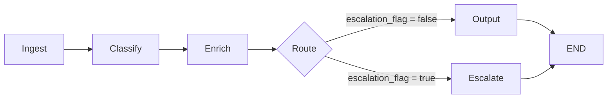
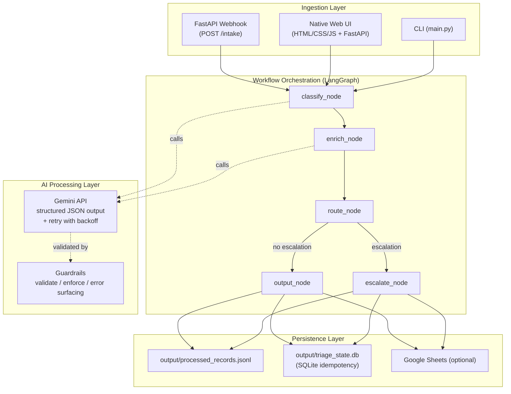

# ArcVault Support Triage System - Architecture Write-Up

## 1. System Design

### Goal

Automate intake, classification, enrichment, routing, and escalation for unstructured ArcVault support requests while producing structured records that downstream teams can act on immediately.

### Pipeline Flow

### Component Architecture

### Components

1. Ingestion Layer
- `ingestion/webhook_api.py` exposes `POST /intake` and `GET /health`.
- Intake supports optional auth via `X-API-Key` when `INTAKE_API_KEY` is configured.
- Payload now supports `request_id`, `customer_id`, `received_at`, and `channel_metadata`.

2. Workflow Orchestration Layer
- `workflow/graph.py` defines a LangGraph pipeline:
  - `classify_node`
  - `enrich_node`
  - `route_node`
  - conditional branch to `output_node` or `escalate_node`
- Graph injects trace metadata (`ingestion_id`, `processing_started_at`, `pipeline_version`).

3. AI Processing Layer
- `integrations/gemini_client.py` calls Gemini with structured JSON output mode (`response_mime_type="application/json"`) and retry with exponential backoff.
- Guardrails in `workflow/nodes.py` strictly validate model outputs and raise explicit classification errors when output is invalid.

4. Persistence Layer
- Runtime append log: `output/processed_records.jsonl` (append-safe JSONL).
- Persistent replay detection: `output/triage_state.db` via SQLite.
- Deterministic deliverable artifact: `output/submission_records.json`.
- Optional Google Sheets sink: `integrations/sheets_client.py`.

### State and Data Contract

`TriageState` tracks input, model outputs, routing, escalation metadata, trace metadata, and output fields.
Key fields:

- `request_id` / `external_id` for idempotency-aware intake
- `ingestion_id`, `processing_ms`, `pipeline_version` for observability
- `classification_guardrail_flags` for model-output validation transparency
- `confidence_level` and `confidence_source` for confidence diagnostics in UI and persisted records
- `escalation_rules_triggered` plus `escalation_rule_evidence` for auditability
- `idempotent_replay` for duplicate detection visibility

## 2. Routing Logic

### Category-to-Queue Mapping

- `Bug Report -> Engineering`
- `Feature Request -> Product`
- `Billing Issue -> Billing`
- `Technical Question -> IT/Security`
- `Incident/Outage -> Engineering`

### Decision Model

1. Compute `proposed_queue` from category map.
2. Evaluate escalation rules.
3. If escalated, set `destination_queue = Human Review`.
4. If not escalated, set `destination_queue = proposed_queue`.

This design preserves ownership intent (`proposed_queue`) while enforcing safe final routing (`destination_queue`).

## 3. Escalation Logic

A message is escalated when any rule is true:

1. `confidence < 0.70`
2. message contains configured escalation keywords (word-boundary matched)
3. category is `Billing Issue` and extracted dollar amount delta is `> $500`
4. category is `Billing Issue` with one dollar amount plus dispute language (`overcharge`, `billing error`, etc.)

Outputs include machine-readable rules and explicit evidence snippets.

## 4. Before vs After (Assessment Boost)

### Before
- Intake accepted only basic fields (`source`, `message`, optional `external_id`).
- No webhook auth toggle.
- Deduplication was in-memory only.
- Runtime output used read-modify-write JSON array.
- Guardrail failures were not surfaced in output records.

### After
- Intake contract is richer and validated (`request_id`, `customer_id`, `received_at`, `channel_metadata`).
- Optional API-key enforcement added for ingestion.
- Idempotency is persistent via SQLite and survives restarts.
- Runtime output is append-safe JSONL.
- Responses/records include trace metadata (`ingestion_id`, `processing_ms`, `pipeline_version`).
- Guardrail and escalation evidence is first-class output data.

## 5. Reliability and Failure Handling

### LLM Robustness

- Structured output mode enforces JSON in the common path.
- Retry with backoff handles transient API failures.
- Invalid classification output triggers explicit guardrail errors.
- Classification failures are surfaced to API/UI instead of silently coercing category/priority/confidence values.
- Enrichment failures return safe fallback fields instead of throwing exceptions.

### Storage Robustness

- Output directory auto-created when missing.
- JSONL append avoids full-file rewrite risks.
- SQLite idempotency table prevents replay duplication across restarts.
- Google Sheets writes are best-effort; failures do not block core workflow.

### API Robustness

- In-memory rate limiting (60 requests/minute) at webhook layer.
- Optional API key enforcement.
- Thread-safe compiled workflow singleton.

### Verification

Tests cover:
- webhook contract validation (legacy payload + new fields + API key behavior)
- low-confidence escalation
- keyword escalation and false-positive guard
- billing delta escalation
- one-amount billing dispute escalation
- output schema and metadata fields
- deduplication + replay detection across store reinit
- concurrent JSONL persistence integrity

## 6. Production Scale Considerations

If promoted beyond assessment scope:

1. Reliability
- Add dead-letter queue for failed records.
- Emit metrics (latency, escalation ratio, replay ratio).
- Move rate limiting from in-memory to shared store.

2. Cost and Latency
- Add cache for repeated message patterns.
- Batch non-critical downstream writes.
- Evaluate cheaper model variants for enrichment.

3. Security
- Replace static API key with signed webhook verification.
- Encrypt persistent artifacts and rotate credentials.
- Add audit events to central log sink.

## 7. Phase 2 (One Additional Week)

1. Human feedback loop for corrected labels and prompt tuning.
2. Subcategory taxonomy for better downstream ownership.
3. Native downstream actions (ticket creation per queue).
4. Dashboard for escalations, drift, and SLA metrics.
